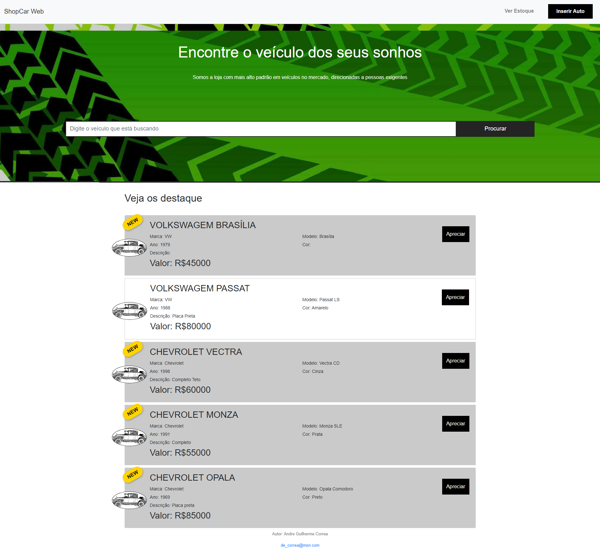
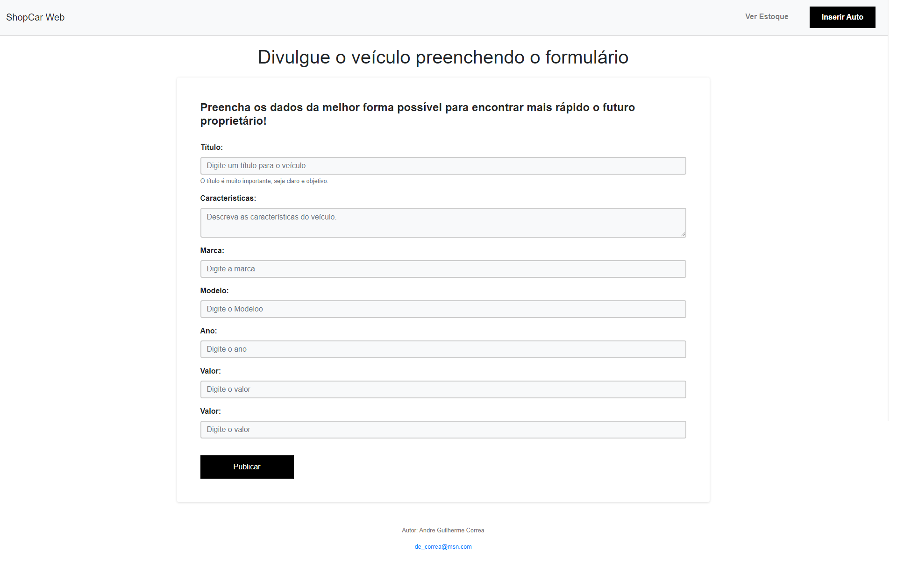
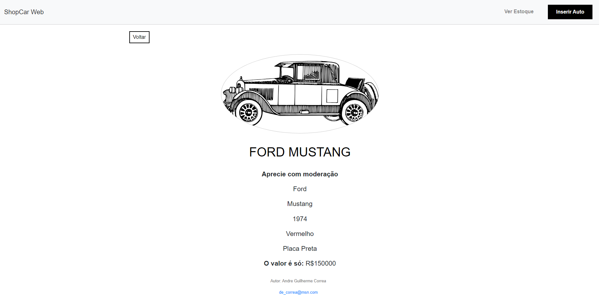

# Web Shop Car


Este é um projeto de um site de e-commerce para carros, desenvolvido usando Node.js, Express, e Handlebars. O sistema permite adicionar novos carros ao estoque, visualizar detalhes dos veículos e procurar por carros disponíveis.

## Índice

- [Visão Geral](#visão-geral)
- [Funcionalidades](#funcionalidades)
- [Instalação](#instalação)
- [Estrutura do Projeto](#estrutura-do-projeto)
- [Tecnologias Utilizadas](#tecnologias-utilizadas)
- [Endpoints](#endpoints)
- [Uso](#uso)
- [Contribuição](#contribuição)
- [Licença](#licença)

## Visão Geral

Este projeto foi desenvolvido como parte de um exercício prático para aplicar conhecimentos em desenvolvimento web. Trata-se de uma aplicação web que permite visualizar uma lista de carros e acessar detalhes sobre cada um deles. Utiliza Express para o servidor e Handlebars para renderizar as views.

## Funcionalidades

- Listagem de veículos disponíveis.
- Visualização detalhada de cada veículo.
- Adição de novos veículos à loja.

## Instalação

Para configurar o projeto em sua máquina local, siga estes passos:

1. Clone o repositório para o seu ambiente local:
   ```bash
   git clone https://github.com/AndreGuilhermeCorrea/web_shopCar.git
   ```

2. Navegue para o diretório do projeto:
   ```bash
   cd web_shopCar
   ```

3. Instale as dependências:
   ```bash
   npm install
   ```

4. Configure o banco de dados:

    Certifique-se de que o banco de dados está configurado corretamente e a conexão está especificada no arquivo db/connection.js.

5. Inicie o servidor:

    O servidor estará disponível em http://localhost:3000.

   ```bash
   npm run dev
   ```

## Estrutura do Projeto

    web_shopcar/
    │
    ├── db/
    │   └── connection.js
    │
    ├── models/
    │   └── ShopCar.js
    │
    ├── public/
    │   ├── css/
    │   │   └── styles.css
    │   ├── img/
    │   │   └── imagens...
    │   └── html/
    │       └── add.hmtl
    │
    ├── routes/
    │   └── shopCars.js
    │
    ├── views/
    │   ├── layouts/
    │   │   └── main.handlebars
    │   ├── add.handlebars
    │   ├── index.handlebars
    │   └── view.handlebars
    │
    ├── index.js
    └── package.json


## Tecnologias Utilizadas

- **Node.js** - Ambiente de execução JavaScript
- **Express** - Framework para servidores web
- **Express Handlebars** - Motor de visualização para templates
- **Body-Parser** - Middleware para análise de dados do corpo das requisições
- **Sequelize** - ORM para Node.js, utilizado para interagir com o banco de dados
- **SQLite** - Banco de Dados SQLite com Sequelize ORM
- **Nodemon** - Ferramenta para reinicialização automática do servidor durante o desenvolvimento
- **HTML** - Linguagem de marcação para estruturar conteúdo web
- **CSS** - Linguagem de estilo para apresentação e layout de páginas web
- **JavaScript** - Linguagem de programação para criar interatividade e lógica no frontend

## Endpoints

- **GET `/shopCars/test`**: Verifica se o servidor está funcionando.
- **GET `/shopCars/view/:id`**: Exibe os detalhes do carro com o ID especificado.
- **GET `/shopCars/add`**: Página para adicionar um novo carro.
- **POST `/shopCars/add`**: Adiciona um novo carro ao banco de dados.

## Uso

   **HomePage**:



### Adicionar um Novo Carro

Para adicionar um novo carro, siga estas etapas:

1. Acesse a página de adicionar carro:
   [http://localhost:3000/shopCars/add](http://localhost:3000/shopCars/add)

   **Página de adição**:

   

2. Preencha o formulário com as informações do carro:
   - **Marca**: A marca do carro (ex: Toyota, Ford).
   - **Modelo**: O modelo do carro (ex: Corolla, Focus).
   - **Ano**: O ano de fabricação do carro.
   - **Cor**: A cor do carro.

3. Clique no botão **"Adicionar Carro"** para enviar os dados.

### Visualizar um Carro Existente

Para visualizar os detalhes de um carro específico, siga estas etapas:

1. Basta clicar em Apreciar.

2. A página exibirá os detalhes do carro, incluindo marca, modelo, ano e cor.

   **Detalhes do Carro**:

   

## Contribuição

Contribuições são bem-vindas! Para contribuir, siga estas etapas:

1. Faça um fork do repositório.
2. Crie uma branch para sua feature ou correção (`git checkout -b minha-nova-feature`).
3. Faça commit das suas mudanças (`git commit -am 'Adiciona nova feature'`).
4. Envie a branch para o repositório (`git push origin minha-nova-feature`).
5. Abra um pull request.

## Licença

Este projeto é licenciado sob a [MIT License](LICENSE).

## Contato

Para dúvidas ou sugestões, entre em contato com [de_correa@msn.com](mailto:de_correa@msn.com).
